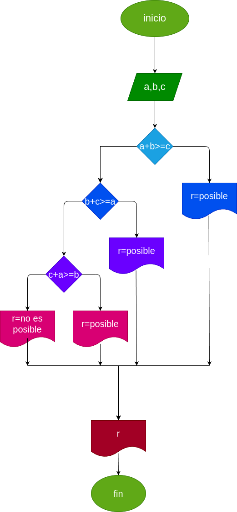

# quiz-12-02-2025-spartan117345

quiz del 12/febrero/2025

## saber si se puede hacer un triangulo

se dijitan tres numeros los cuales son el tamaño de los lados

- si la suma de dos lados es menor a la del tercero el triangulo no se puede hacer

- si la suma de dos lados es mayor a el tercer lado el triangulo se puede hacer

# analisis

## input

### variable

dijite el primer numero: es un lado del triangulo

dijite el segundo numero: es otro lado del triangulo

dijite el tercer numero: es el ultimo lado del triangulo

### prossecing

a+b >= c: es posible hacer el triangulo

a+c >= b: es posible hacer el triangulo

b+c >= a: es posible hacer el triangulo

si ninguna condicion sirve el triangulo no se puede hacer

# diseño

# construccion